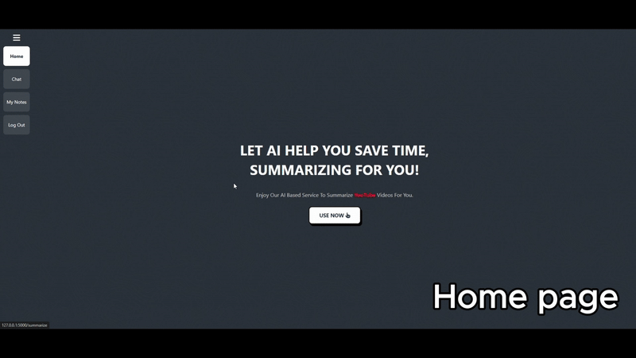

# YouTube AI Summarizer 🎥🤖

A web-based application that allows users to summarize YouTube videos using advanced AI language models. Simply paste a YouTube URL, and get a concise, structured summary in seconds.

## ✨ Features

- 🔗 Accepts YouTube video URLs
- 📄 Extracts video transcripts automatically
- 🧠 Uses OpenAI GPT to generate accurate and readable summaries
- 📋 Structured output: Key points, highlights, insights, and conclusion
- 💬 AI chat interface to ask questions about the video content
- 📊 Compare summaries between two YouTube videos
- 🔒 Login/signup system with user authentication (SQLite)
- 🖥️ Clean and responsive frontend with Flask backend

## 🚀 Demo



---

## 🛠️ Tech Stack

| Frontend      | Backend        | AI/ML                   | Database |
|---------------|----------------|-------------------------|----------|
| HTML, CSS, JS | Python (Flask) | OpenAI GPT-4o / GPT-3.5 | SQLite   |

---

## 📦 Installation

```bash
# 1. Clone the repository
git clone https://github.com/Kusbah/youtube-ai-summarizer.git
cd youtube-ai-summarizer

# 2. Set your OpenAI API key
export OPENAI_API_KEY="your-api-key"  # On Windows use 'set'

# 3. Run the Flask app
python app.py
